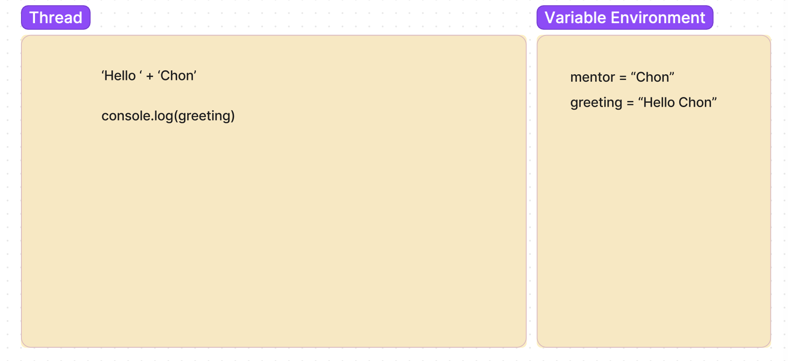

# Functions & Execution Contexts

[Figjam](https://www.figma.com/file/zBrYcMXD6s4uluVdAAvvvL/Untitled?type=whiteboard&node-id=0-1&t=JgggFvUSxzYDy081-0)

The first part of this lecture aims to consolidate students' understanding of how to use functions. Differentiating clearly between when a function is declared and when it is invoked provides valuable context for the second part of the lecture where we introduce the 3 core components of an execution context diagram.

## Learning Objectives

- Know that Node is that runtime environment we use to execute our JavaScript code
- Understand the difference between a function declaration and invocation
- Understand the difference between function arguments and parameters
- Understand the use of the return keyword
- Understand when a function may be useful
- Know the purposes different components of an execution context diagram:
  - Thread
  - Variable environment
  - Call stack

## What is Node?

Just writing some code in a JavaScript file is not enough.

We need some software to execute the instructions in the file.

For this we use `Node`

- Node is what is known as a runtime environment (it has everything that is required to run JS)
- Originally JS was created purely to run in Internet Browsers
- Node was based on Google Chromes JavaScript Engine (V8)
- It allows us to run what is termed "server-side" JavaScript on our local machines

> Use Node to run local file

## What actually happens during execution?

We're going to take a look at something that will allow us to understand our code better and in turn solve problems that crop up.

Take a look at this code snippet:

```js
const mentor = 'Chon';
const greeting = 'Hello ' + mentor;
console.log(greeting);
```

JavaScript executes the code line by line and any data is assigned to variables in memory.

We're going to take a look at something called an execution context diagram to examine this more closely.

**Show execution diagram in FigJam with code screenshot**

Explain Two Key Concepts:

- Thread: where our code is executed, i.e. where things are "worked out"

- Variable environment: where variables go when we declare them, we will look here when we need to use a variable later

---

Walk through execution line by line:

1. First variable is added to the variable environment
2. Second variable is added however JS needs to figure out what it should hold as it is not a simple value. It is an **expression**.

> "expression" - a combination of data and operators/functions which will eventually work out to be a single value

3. In order to do this the first variable in read from the variable environment and the expression is evaluated in the thread

Should end up with something like this:



## Applying same logic again: Functions

Cool shit

## Declaring and Invoking Functions

## Params & Args

## Returning

## Exc Diagram Pt.2: Function Boogaloo

## Recap

- JS runs line-by-line, top-to-bottom
- It is single threaded, which means only one thing can happen at a time
- The difference between arguments and parameters
- When a function is called it creates an execution context and its own local memory. The local memory is called a 'variable environment'
- The call stack keeps track of the thread by pushing things on when they're called, and popping them off when they've resolved
