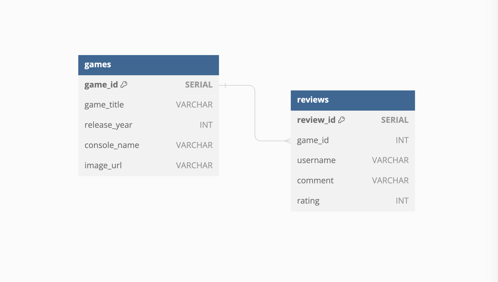

# Seeding with PG8000

An example repo for the seeding with PG8000 seminar.

## Setup

- Create a virtual environment
- Install [`pg8000`](https://pypi.org/project/pg8000/) into the virtual environment

To setup the example DB:

- `psql -f ./db/db-setup.sql`

This will create an database called named `nc_games`.

## Included in the repo

- data stored in Python files > this can be imported as a dictionary from `db/data/index.py`
- connection object in `db/connection.py`
- `db/seed.py` > file containing seed function
- `db/run-seed.py` > this script will execute the imported seed function (passing in the data as kwargs), it will print any exceptions and close the DB connection.

**Solutions provided for seed function**

Can use `db/run-seed.py` then `db/scratch.sql` to "test" your seed function.

